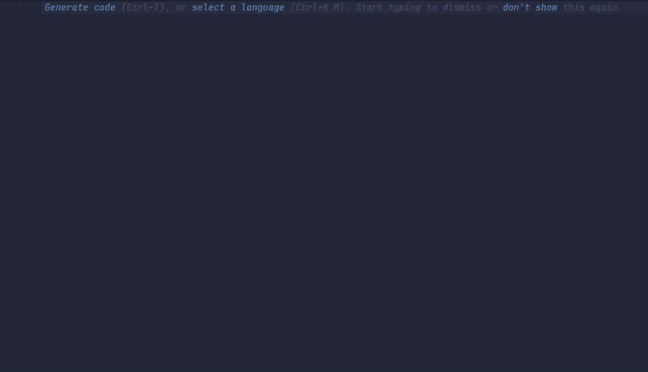

# Xen

<p align="center">
    
</p>

<p align="center">
    <a href="#getting-started">Getting Started</a> | <a href="https://xenlanguage.github.io/documentation.html">Documentation</a> | <a href="#examples">Examples</a>
</p>

---

Xen is a loosely-typed, imperative scripting language written in C. Its syntax closely resembles C-like languages and the interpreter itself is a mere 120 Kb in size. Its primary purpose is to serve as a learning project for myself and a fun side project to work on in my free time. **It is not designed with the intent of being a serious, production-ready language.**

<p align="center">
    
</p>

## Getting Started

If you want to try Xen out, you can download one of the pre-compiled binaries from our [releases](https://github.com/jakerieger/Xen/releases/latest).
Xen currently has releases for Windows (x64), Linux (x64), and macOS (x64/ARM64).

If you prefer to build from source, the process is pretty straight-forward. Xen uses a bash script ([generate_build.sh](generate_build.sh)) to generate Ninja build files for each platform.

### 1. Clone the repository

```
$ git clone https://github.com/jakerieger/Xen
$ cd Xen
```

### 2. Run the configuration script

```
$ ./generate_build.sh
```

### 3. Build

```
$ ./build.sh <platform> <config> # i.e. linux debug
```

> The final binary will be located in the `build` directory.

### 4. Running Xen

If you just want to run Xen immediately after building it, you can use the `run.sh` script:

```
$ ./run.sh <platform> <config> [args for Xen...]
```

## Editor Support

While an LSP is still in development, there are syntax highlighting support extensions for both VS Code and Neovim:

- [Download (VS Code)](https://github.com/XenLanguage/Xen-VSCode)
- [Download (Neovim)](https://github.com/XenLanguage/Xen-Neovim)

## Examples

Example code can be found in the [examples](examples) directory. The [syntax.xen](examples/syntax.xen) file showcases the entire syntax of Xen.

## License

**Xen** is licensed under the [ISC license](LICENSE).
